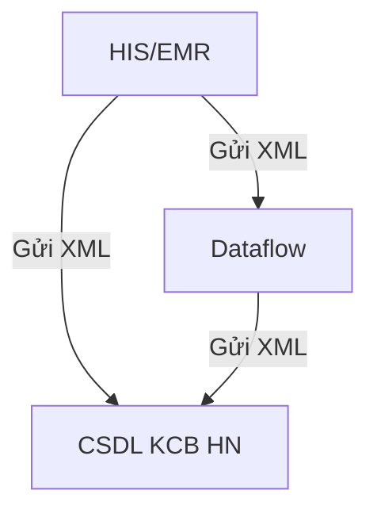
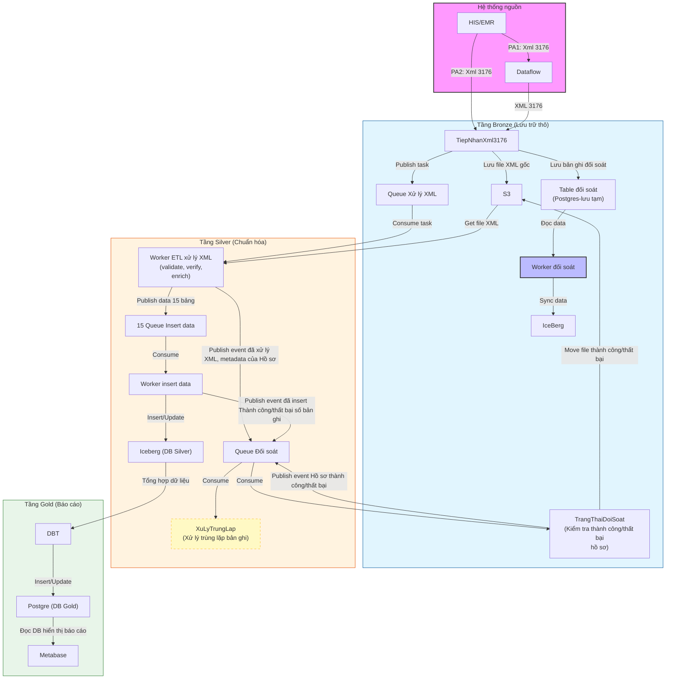
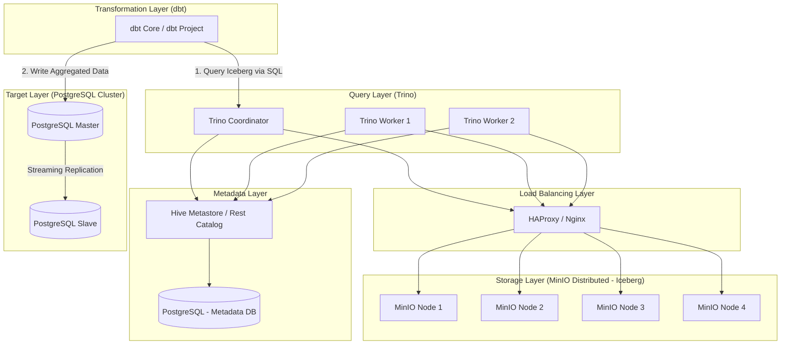
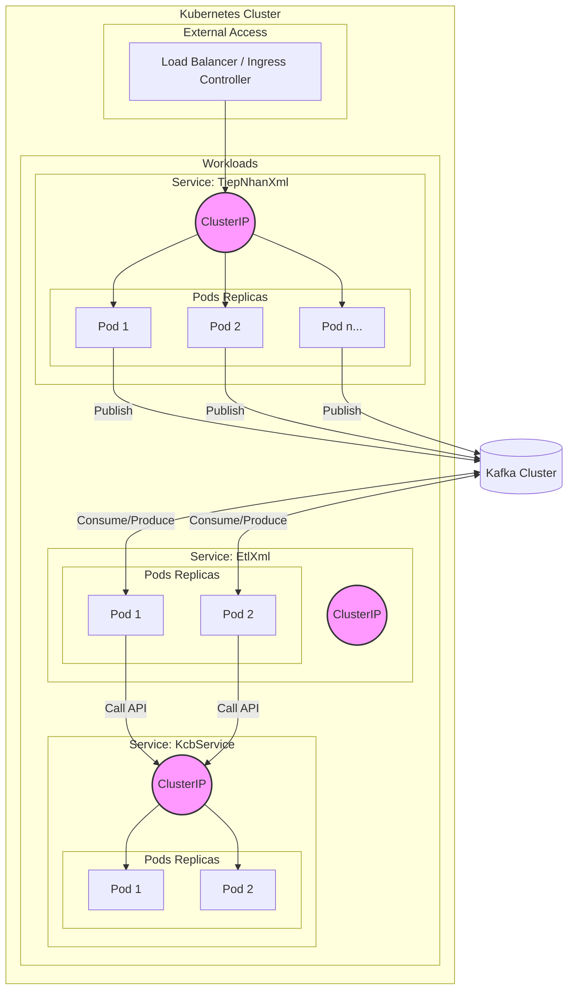

ETL dữ liệu XML theo chuẩn 3176, 4750, 130 để nạp vào CSDL Khám Chữa Bệnh Hà Nội (CSDL KCB HN). Phục vụ mục đích dashboard.

# Context diagram

# Dataflow diagram

# Mô hình cài đặt
## Cài đặt Iceberg, Trino, DBT

## Cài đặt .NET service
